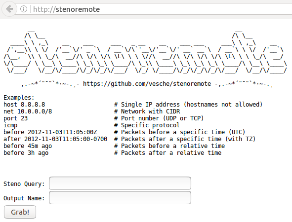

# Stenoremote

This is a little hack and primitive web interface for [Google Stenographer](https://github.com/google/stenographer) to do [currently unsupported](https://github.com/google/stenographer/blob/master/DESIGN.md#serving-data) remote requests. Running `install.sh` will install and configure an Apache web server on RHEL/CentOS 7 that hosts a web interface that is capable of requesting and downloading raw packet capture from Stenographer. This was designed to be used with the [ROCK NSM](http://rocknsm.io/) platform on an internal network.

## Install
In order for this to work you'll need to open Stenographer to the outside. On the server you're running Stenographer on, modify `/etc/stenographer/config` to use `"Host": "0.0.0.0"` and then restart stenographer.

Run `./install.sh` on a RHEL/CentOS 7 system that can communicate with your Stenographer server. The script will prompt to scp the `client_cert.pem` and `client_key.pem` that will be necessary to use Stenoremote, although this can be done manually if desired.
